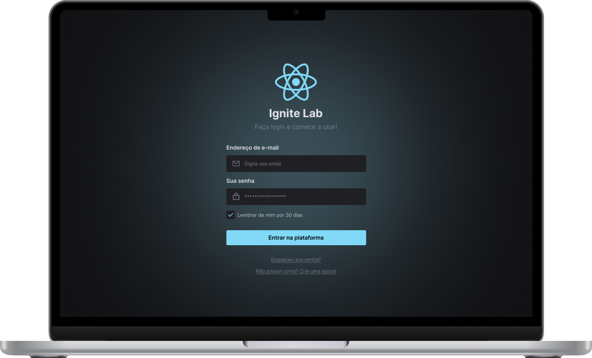

<p align="center">
   
</p>

<h1 align="center">Ignite Lab - Design System</h1>

<h3 align="center">
  :rocket: Projeto desenvolvido durante o Ignite Lab, evento disponibilizado gratuitamente pela RocketSeat. 🚀
</h3>


# :computer: Tecnologias

Este projeto foi feito utilizando as seguintes tecnologias:

* [ReactJS](https://reactjs.org/)
* [Typescript](https://www.typescriptlang.org/)
* [Tailwind CSS](https://tailwindcss.com/)
* [ViteJS](https://vitejs.dev/)
* [Storybook](https://storybook.js.org/)
* [Radix UI](https://www.radix-ui.com/)
* [clsx](https://www.npmjs.com/package/clsx)


## Como Iniciar?

### Requisitos

- [Yarn](https://classic.yarnpkg.com/) ou [npm](https://www.npmjs.com/package/npm)

**Clone o projeto e acesse a pasta**

```bash
git clone https://github.com/DiogoAMV/lab-ds.git && cd lab-ds
```

**Siga os passos abaixo**

```bash
# Instale as dependências
$ npm install ou yarn
# Inicie a aplicação
$ npm run dev ou yarn dev
```

## :memo: Licença

Esse projeto está sob a licença MIT. Veja o arquivo [LICENSE](LICENSE.md) para mais detalhes.

---

Feito com :purple_heart: by [Diogo Marques](https://github.com/DiogoAMV)

[](https://www.linkedin.com/in/diogo-marques-719950221/) 
[](mailto:contato.diogoamv@gmail.com)
